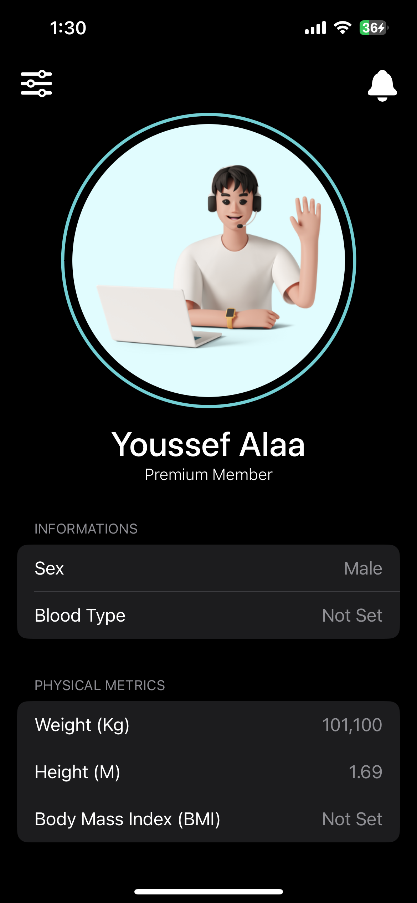
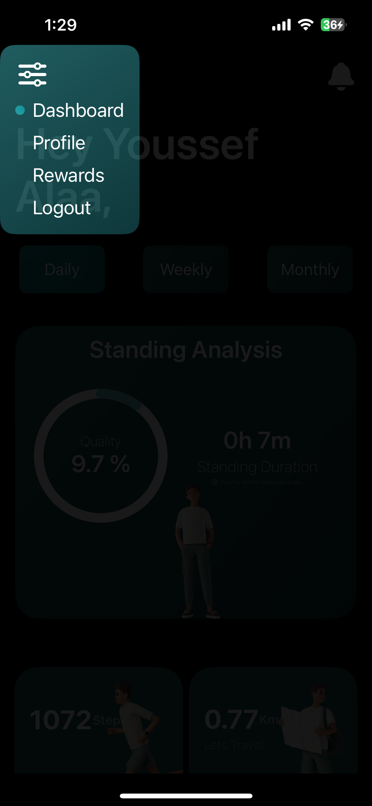
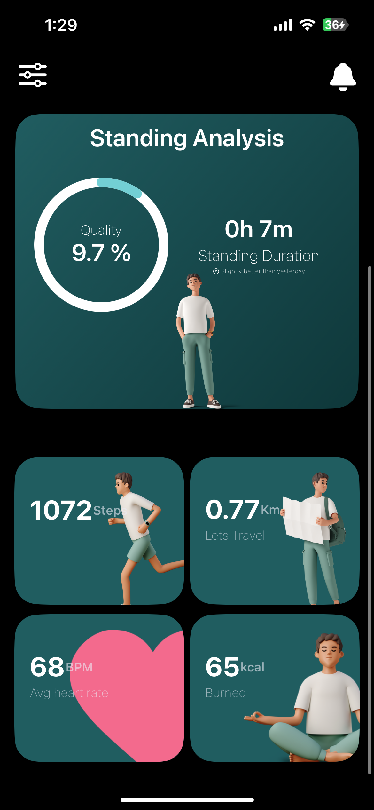
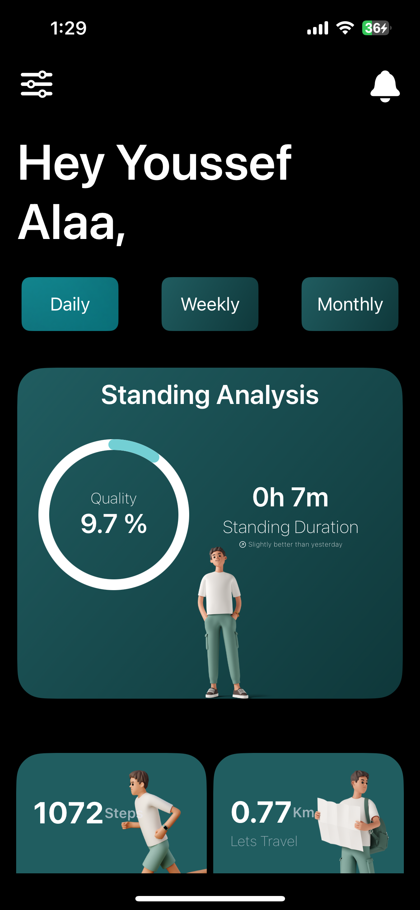

# Heal

Heal is a health-tracking application built using SwiftUI. It leverages HealthKit to access and display user's health data, providing an intuitive and visually appealing interface. Users can view their daily, weekly, and monthly activity data, including calories burned, average heart rate, steps taken, distance walked, and standing time. The app also features a daily steps goal, which, when achieved, rewards the user. Authentication is managed through Firebase, allowing users to sign up, sign in, and sign out securely.

## Features

- **Health Data Tracking**: Displays daily, weekly, and monthly data for calories burned, average heart rate, steps taken, distance walked, and standing time.
- **Daily Steps Goal**: Users can set a daily steps goal and receive rewards upon achieving it.
- **User Authentication**: Secure sign up, sign in, and sign out functionalities using Firebase.
- **User-Friendly Interface**: Designed with SwiftUI to provide a seamless and engaging user experience.

## Screenshots
|  |  |  |
| --- | --- | --- |
|  |  |  |

## Technologies Used

### SwiftUI
SwiftUI is a modern framework used to build the Heal application. It allows for the creation of sophisticated user interfaces with less code and provides real-time previews of the UI, making the development process more efficient and dynamic.

### HealthKit
HealthKit is integrated into the Heal app to access and manage the user's health data. This framework allows the app to retrieve data such as calories burned, heart rate, steps, distance, and standing time directly from the Health app on iOS devices.

### Firebase
Firebase is used for user authentication in the Heal app. It provides a secure and reliable way to handle user sign up, sign in, and sign out processes. Firebase ensures that user data is protected and authentication processes are streamlined.

## Installation

1. Clone the repository:
    ```sh
    git clone https://github.com/youssef-alaaeldin/heal.git
    ```
2. Navigate to the project directory:
    ```sh
    cd heal
    ```
3. Open the project in Xcode:
    ```sh
    open Heal.xcodeproj
    ```
4. Install dependencies using CocoaPods:
    ```sh
    pod install
    ```
5. Open the `.xcworkspace` file in Xcode:
    ```sh
    open Heal.xcworkspace
    ```

## Usage

1. Ensure you have the necessary permissions to access HealthKit data on your iOS device.
2. Make sure that you have an apple watch to get the best from the application.
3. Build and run the application on your device.
4. Sign up or sign in using your Firebase credentials.
5. Allow the app to access your health data.
6. Start tracking your daily, weekly, and monthly activities.

## Contributing

Contributions are welcome! Please open an issue or submit a pull request with your changes. Make sure to follow the existing code style and include relevant tests for new features.

## License

This project is licensed under the MIT License. See the [LICENSE](LICENSE) file for more details.

## Acknowledgements

- [Apple HealthKit](https://developer.apple.com/healthkit/)
- [Firebase](https://firebase.google.com/)
- [SwiftUI](https://developer.apple.com/xcode/swiftui/)

---

